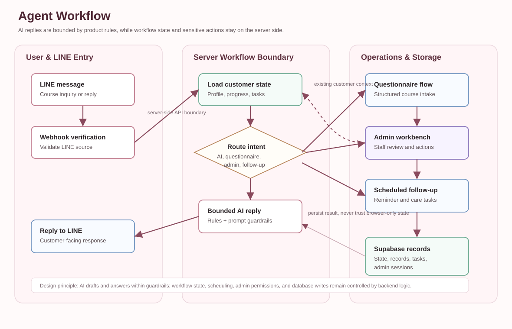

# LINE AI Customer Service & Student Care Workflow

This is a public portfolio showcase for a LINE-based AI customer service and student care workflow system designed around a beauty education use case.

> This showcase does not include production source code, real customer data, private URLs, API keys, tokens, or business-sensitive configuration.

## One-Line Summary

This project is not just a chatbot. It is an AI application prototype that connects LINE Bot messaging, AI replies, course questionnaires, student records, pre-course reminders, and post-course follow-up workflows.

## Background

Beauty education and personal-service businesses often face repeated operational problems:

- Customers ask similar course questions through LINE.
- Staff need to collect information and send reminders before a course.
- Follow-up care after a course is valuable but easy to miss when handled manually.
- A basic FAQ chatbot cannot connect conversations to operational records and workflow states.

The goal of this project is to turn AI customer service into a workflow-connected application, not merely a bot that replies to messages.

## Demo Screenshots

All screenshots use anonymized demo data. They do not contain real names, LINE IDs, URLs, tokens, or private records.

| Search workflow | Records workflow |
|---|---|
|  |  |

## System Architecture

High-level flow:

1. The user starts from a LINE Official Account.
2. The LINE webhook receives and verifies incoming messages.
3. The workflow engine determines whether the message belongs to AI reply handling, a structured questionnaire, an existing workflow, or a follow-up task.
4. The OpenAI API generates bounded AI replies under product and prompt rules.
5. Supabase stores customer states, course records, follow-up tasks, and admin sessions.
6. The Admin UI helps staff manage student care status and reminder tasks.
7. Vercel Cron triggers scheduled reminders and follow-up tasks.

## Agent Workflow

This diagram highlights the trust boundary of the AI workflow: AI only generates replies within product rules and prompt guardrails, while customer state, questionnaire progress, scheduled tasks, admin permissions, and database writes stay under server-side workflow control.

## Core Features

- LINE Bot webhook integration
- AI customer-service replies
- Structured course questionnaire flow
- Student care admin workbench
- Pre-course reminder workflow
- Post-course care workflow
- Supabase-backed state and task storage
- Protected admin API boundary
- Scheduled follow-up task runner
- Portfolio-ready documentation, screenshots, and architecture diagram

## Tech Stack

- LINE Messaging API
- OpenAI API
- Supabase Postgres
- Vercel Serverless Functions
- Vercel Cron
- HTML / CSS / JavaScript admin UI
- Git / GitHub
- AI-assisted development with Codex and Claude Code

## AI / Agent Workflow Design

- AI does not directly control all workflow states. Critical states are managed by server-side workflow logic and the database.
- Prompts constrain the direction and tone of AI replies, but they do not handle authorization, payment logic, or trusted database writes.
- Customer state, questionnaire progress, and follow-up tasks are persisted in Supabase.
- Admin actions go through protected APIs, keeping sensitive business logic out of the browser.
- Reply handling and scheduled care workflows are separated so the AI service can connect to downstream operations.

## Project Outcome

The project is currently positioned as a showcaseable AI application prototype:

- Designed an end-to-end LINE AI customer service and student care workflow.
- Built anonymized admin workbench screenshots for portfolio presentation.
- Organized architecture documentation for GitHub and interview use.
- Established a clear split between the private source repo and the public showcase repo.

Actual business impact should be measured after production usage, including completion rate, reply efficiency, reminder success rate, and manual time saved.

## My Role and Contributions

I owned the flow from product requirement breakdown to system documentation:

- Translated beauty education customer-service needs into implementable workflows.
- Designed the boundaries between LINE Bot, AI replies, Supabase storage, Admin UI, and scheduled tasks.
- Used Codex and Claude Code to accelerate development, debugging, documentation, and safety review.
- Prepared portfolio-ready README content, architecture diagrams, anonymized screenshots, and interview materials.

## Demo Walkthrough

This showcase can currently be understood through the README, architecture diagram, and anonymized screenshots.

If a short demo video is added later, it will demonstrate this end-to-end flow:

1. A user starts a course inquiry from LINE.
2. The backend routes the message through workflow logic.
3. AI generates a reply within product rules and prompt boundaries.
4. Student care tasks appear in the admin workbench.
5. Staff review reminders, records, and follow-up status.

Any demo video will use anonymized data only. It will not show real customer records, private admin links, environment variables, or production settings.

## Roadmap

- Add a short anonymized demo video.
- Add more anonymized demo cases.
- Improve production hardening around follow-up idempotency, observability, access control, and data privacy workflows.

## Notes

- This repository is a public showcase, not the full open-source project.
- Full source code, production secrets, real customer data, and business-sensitive workflows are not public.
- Screenshots and cases use demo data.
- Private source access can be provided separately for interviews or collaboration discussions.
