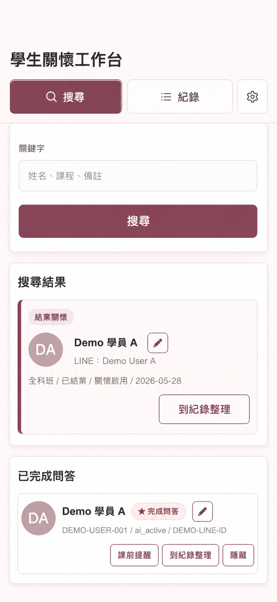
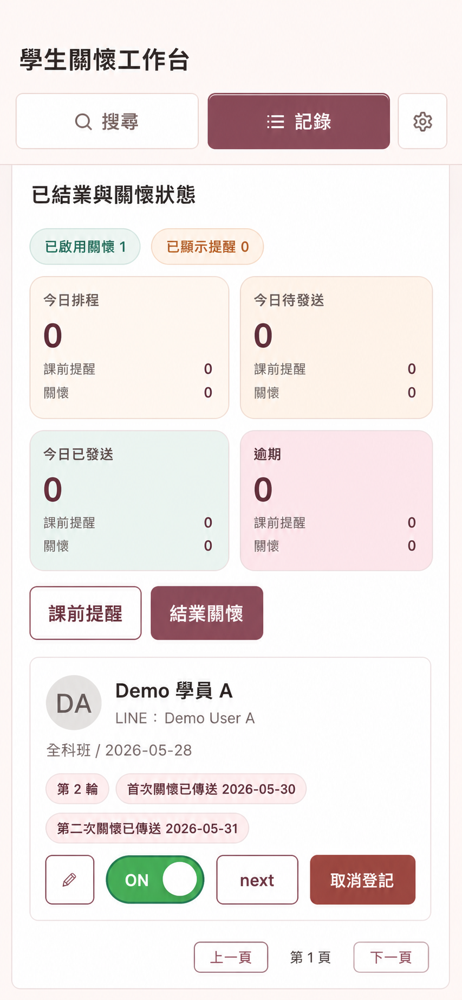
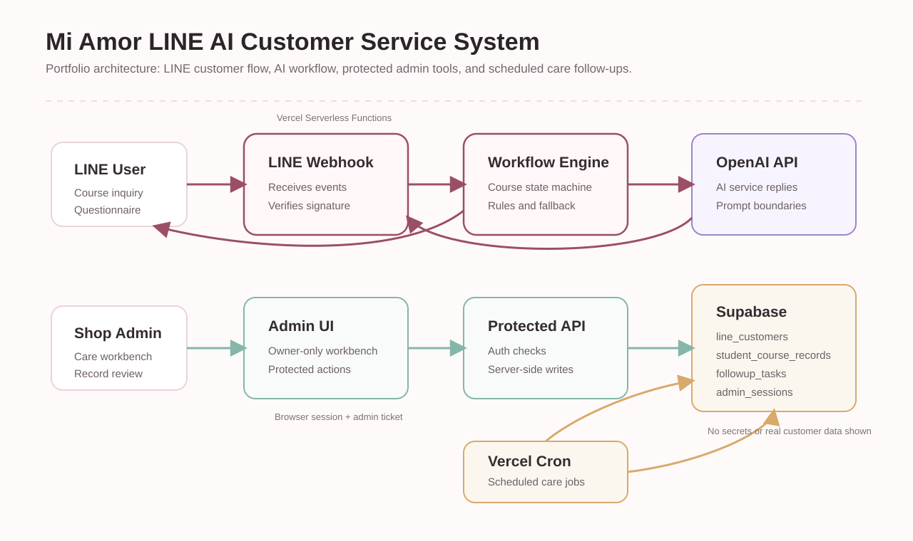

# LINE AI Customer Service & Student Care Workflow

Public showcase for a LINE-based AI customer service and student care workflow system.

這是一個作品集展示版，介紹一套針對美容教育場景設計的 LINE AI 客服與學生關懷 workflow 系統。

> This public repository contains only anonymized showcase materials. It does not include production source code, real customer data, private URLs, API keys, tokens, or business-sensitive configuration.

## Language

- [繁體中文](README.zh-TW.md)
- [English](README.en.md)

## Preview

| Search workflow | Records workflow |
|---|---|
|  |  |

## Architecture

## About This Showcase

This repository is designed for portfolio and interview review. It focuses on product thinking, AI workflow design, LINE Bot integration, Supabase-backed state management, and the operational boundary between AI replies and admin workflows.

For the full project explanation, choose a language above.
