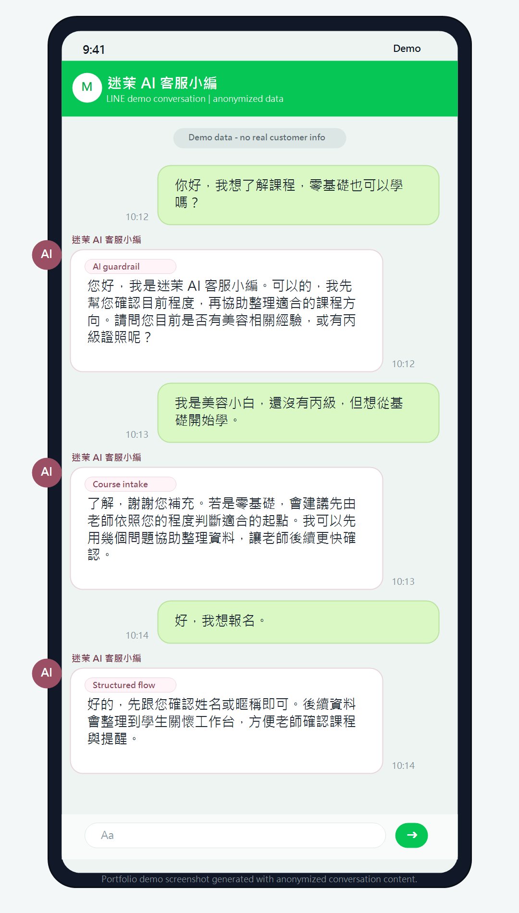

# Demo Cases

所有案例皆為匿名 demo，用來說明系統流程，不包含真實客戶資料。

## Demo Case 1：LINE 課程諮詢

使用者從 LINE 詢問課程資訊。系統透過 webhook 接收訊息，判斷是否可由 AI 回覆，並在需要時引導進入課程問卷流程。

展示重點：

- LINE Bot integration
- AI customer-service response
- Workflow routing

展示截圖：

## Demo Case 2：學生關懷工作台搜尋

店家在 admin workbench 搜尋學生，查看是否已結業、是否啟用關懷，以及是否需要整理紀錄。

展示截圖：

展示重點：

- Admin UI
- Student record search
- Care status overview

## Demo Case 3：已結業與關懷狀態管理

店家查看已結業學生的關懷狀態、課前提醒與課後關懷任務。

展示截圖：

展示重點：

- Follow-up task visibility
- Care workflow status
- Human-in-the-loop operation
